# DormDropv2: A Localized Peer-to-Peer Web Marketplace and Real-Time Negotiation Platform
## 1. Introduction
### Background of the Study
Within university ecosystems, students frequently need to buy, sell, or trade essential items such as textbooks, uniforms, electronics, and dormitory appliances. Traditionally, this commerce takes place on fragmented platforms like public Facebook groups, campus bulletin boards, or general-purpose marketplaces. These platforms pose several challenges: they lack student-specific moderation, are prone to scams by external actors, and often feature cluttered, non-intuitive interfaces. 

### Problem Statement
Current solutions for campus trading are inadequate due to:
* **Security Risks:** General marketplaces expose students to off-campus strangers, increasing the risk of fraud and safety concerns during meetups.
* **Poor User Experience:** Existing platforms are often cluttered with irrelevant advertisements and are not optimized for quick, mobile-based interactions.
* **Fragmented Communication:** Buyers and sellers must often switch to third-party messaging apps to negotiate, leading to lost contexts and disjointed transactions.

### Proposed Solution
DormDropv2 solves these problems by providing an exclusive, closed-loop marketplace. It integrates secure authentication, dynamic item listings, personalized user profiles, and a real-time asynchronous JavaScript (AJAX) chat engine directly into a single, mobile-optimized application.

---

## 2. Core Features
* **Secure Authentication:** Encrypted passwords, customized security question recovery workflows, and protected session management.
* **Marketplace Engine:** A dynamic, mobile-responsive grid displaying all active campus listings, ordered chronologically.
* **Real-Time AJAX Chat:** An integrated peer-to-peer messaging system that fetches new messages instantly without requiring page refreshes, optimizing the negotiation process.
* **Dashboard & Inventory Management:** Personalized user profiles featuring custom avatars, bios, and a dedicated "My Listings" grid to manage active items for sale.
* **Image Processing:** Automated backend sanitization and hex-code renaming for all user-uploaded profile avatars and item images.

---

## 3. Technology Stack
DormDropv2 employs a modern Python-based web stack, adhering to the Model-View-Template (MVT) architectural pattern.

* **Backend Framework:** Python 3.12 / Flask (Pallets, 2010). 
* **Database Management:** SQLite3 / Flask-SQLAlchemy (File-based relational database).
* **Security & Authentication:** Flask-Bcrypt (password hashing) and Flask-Login (session management).
* **Frontend Technologies:** HTML5, CSS3, Jinja2 (Templating Engine), and Vanilla JavaScript.
* **Asynchronous Logic:** Fetch API / AJAX for real-time chat polling and DOM manipulation.

---

## 4. Database Schema
The relational database consists of three primary tables managed via SQLAlchemy ORM.

### 4.1 User Table (`users`)
| Column Name | Data Type | Constraints | Description |
| :--- | :--- | :--- | :--- |
| `id` | Integer | Primary Key | Unique identifier for the user. |
| `full_name` | String(100) | Not Null | User's complete name. |
| `email` | String(120) | Unique, Not Null | University email address (login credential). |
| `password` | String(60) | Not Null | Bcrypt hashed password. |
| `security_question` | String(150) | Not Null | Account recovery question. |
| `security_answer` | String(60) | Not Null | Bcrypt hashed recovery answer. |
| `profile_image` | String(20) | Default | Filename of the user's avatar. |
| `bio` | String(30) | Nullable | Short user biography. |

### 4.2 Item Table (`items`)
| Column Name | Data Type | Constraints | Description |
| :--- | :--- | :--- | :--- |
| `id` | Integer | Primary Key | Unique identifier for the listing. |
| `title` | String(100) | Not Null | Name of the product being sold. |
| `price` | Float | Not Null | Listed price in local currency. |
| `description` | Text | Not Null | Detailed product description. |
| `image_path` | String(20) | Default | Filename of the uploaded product image. |
| `owner_id` | Integer | Foreign Key | Links the item to the user who posted it. |

### 4.3 Message Table (`messages`)
| Column Name | Data Type | Constraints | Description |
| :--- | :--- | :--- | :--- |
| `id` | Integer | Primary Key | Unique identifier for the message. |
| `sender_id` | Integer | Foreign Key | The user sending the message. |
| `receiver_id` | Integer | Foreign Key | The user receiving the message. |
| `content` | Text | Not Null | The actual text of the message. |
| `timestamp` | DateTime | Default: UTC | Exact time the message was sent. |

---

## 5. Installation and Setup Guide
Follow these steps to deploy and run DormDropv2 on your local machine.

### Prerequisites
* Python 3.10 or higher installed on your system.
* Git installed on your system.

### Step-by-Step Execution
**1. Clone the Repository**
Open your terminal and clone this project to your local machine:
```bash
git clone [https://github.com/YOUR_USERNAME/YOUR_REPOSITORY_NAME.git](https://github.com/YOUR_USERNAME/YOUR_REPOSITORY_NAME.git)
cd YOUR_REPOSITORY_NAME

Create a Virtual Environment:
# For Windows:
python -m venv venv

# For macOS/Linux:
python3 -m venv venv

Activate the Virtual Environment
# For Windows:
.\venv\Scripts\activate

# For macOS/Linux:
source venv/bin/activate

Install Dependencies
pip install -r requirements.txt

Initialize the Database
Note: The SQLite database (dormdrop.db) will be automatically 
generated inside the instance/ folder upon the first run.

Run the Application:
python run.py
```
## 6. System Interface & Screenshots

* **Login:**
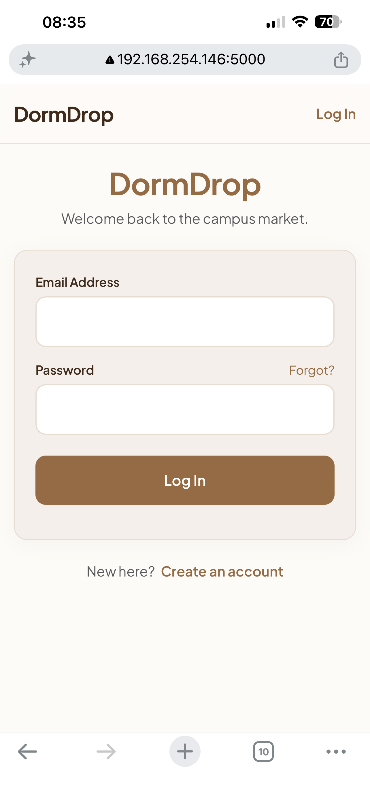

* **Registration (Step 1):**
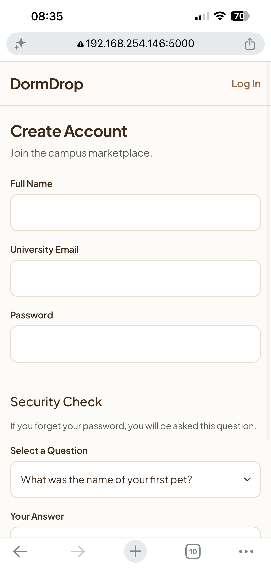

* **Registration (Step 2):**
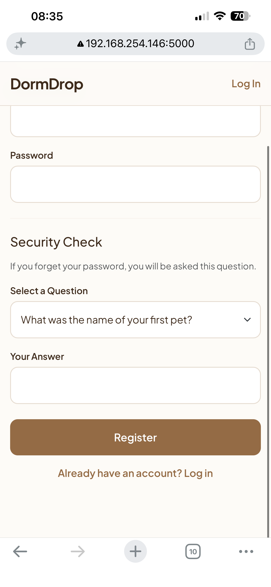

* **Forgot Password:**
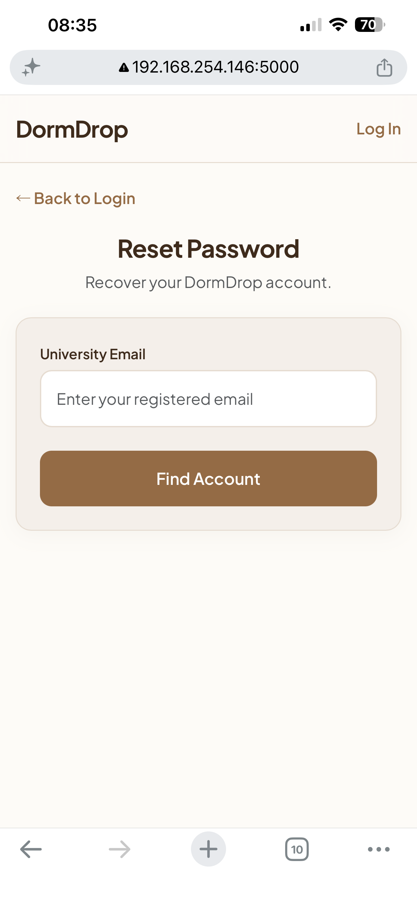

* **Marketplace Feed:**


* **Item Details:**
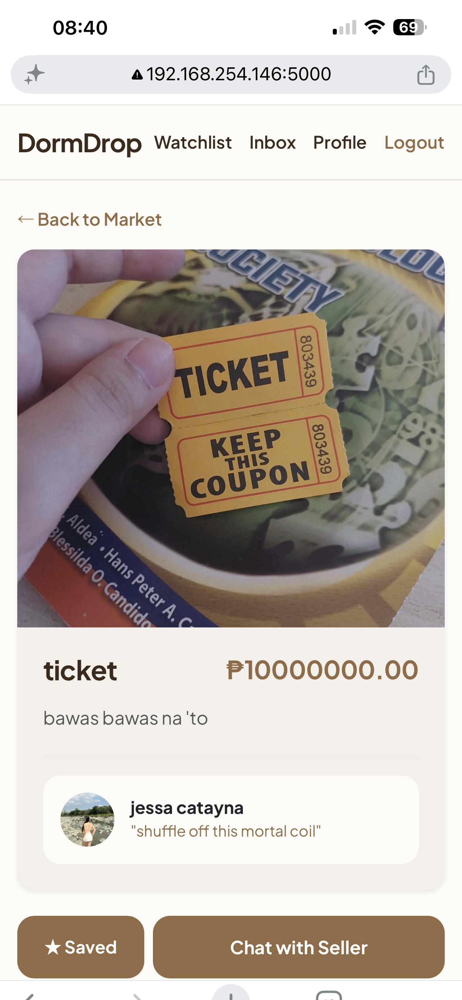

* **Post a New Listing:**
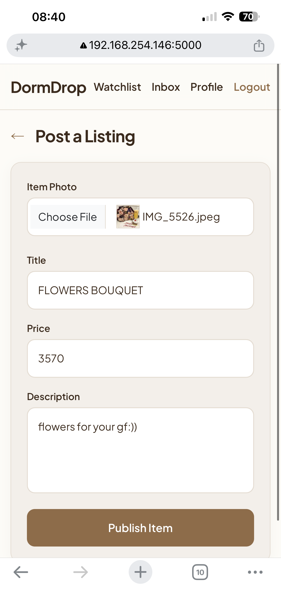

* **Watchlist:**
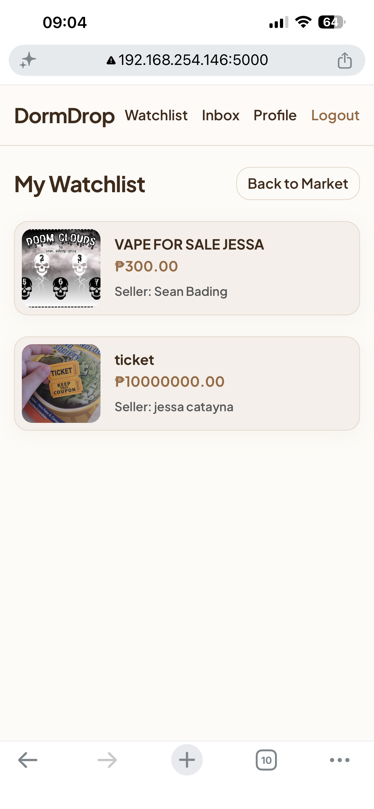

* **Inbox Messages:**
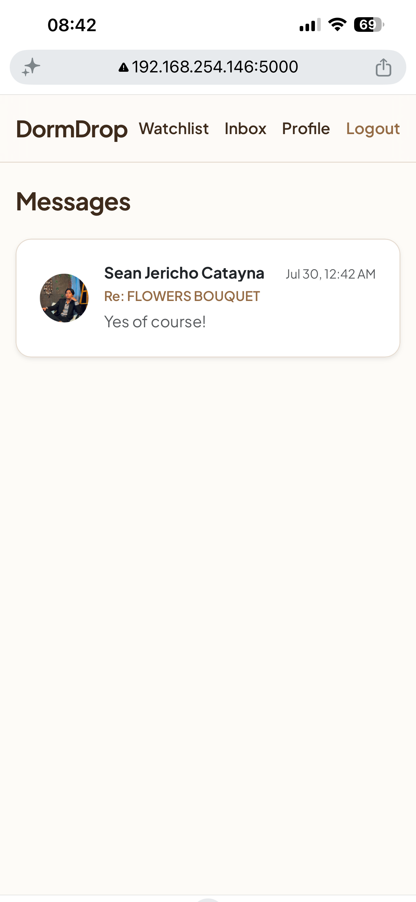

* **Active Chat Conversation:**
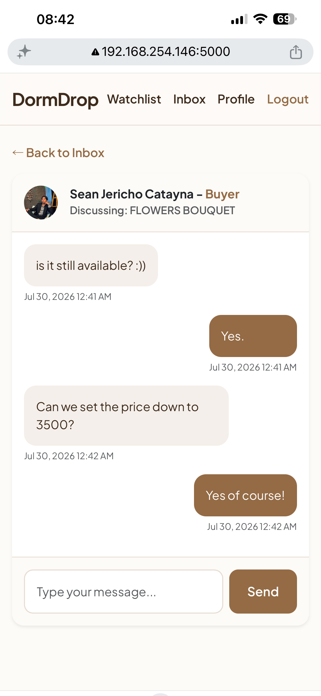

* **User Profile:**
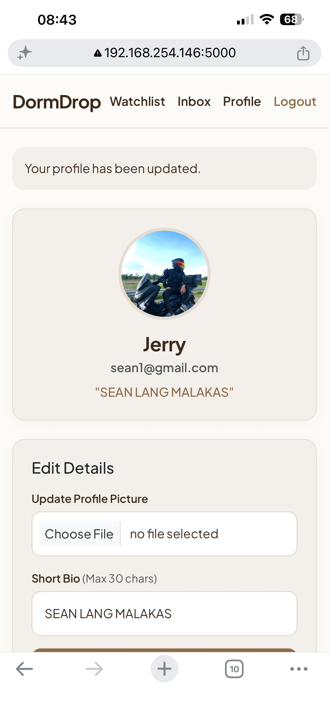

* **My Active Listings:**
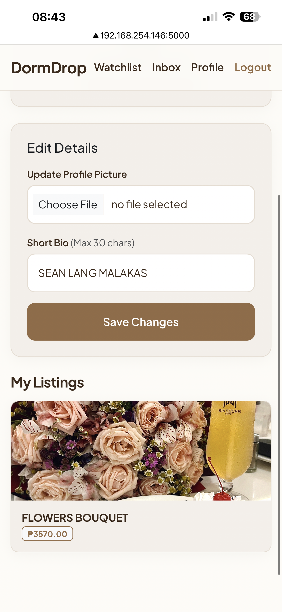


---

## 7. Security Implementation
Security is paramount in an application handling user data and communication.
1. **Password Cryptography:** Passwords are never stored in plain text. Bcrypt applies a randomized "salt" to each password before hashing, protecting the database against rainbow-table attacks.
2. **Directory Traversal Prevention:** When users upload images, the system relies on secure filename generation (`secrets.token_hex`), ignoring the user's original file path to prevent malicious scripts from being uploaded to sensitive server directories.
3. **Route Protection:** Unauthenticated users attempting to access protected routes are intercepted by the `@login_required` wrapper and redirected to the login page.